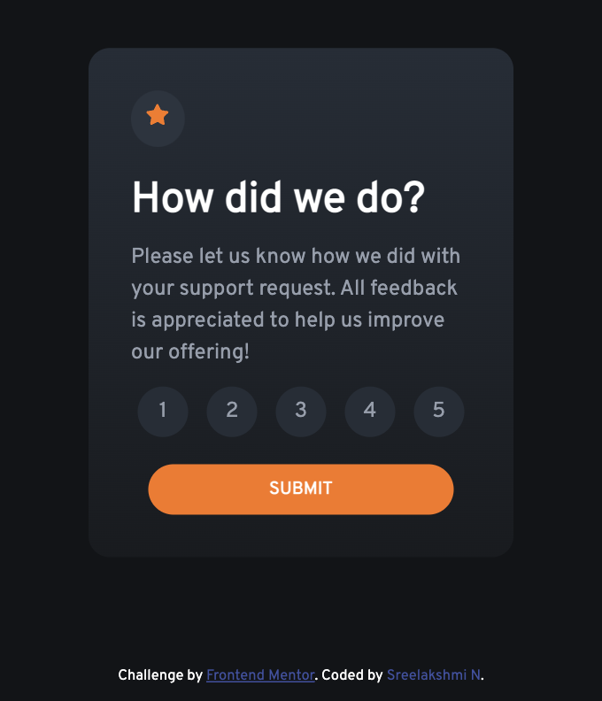
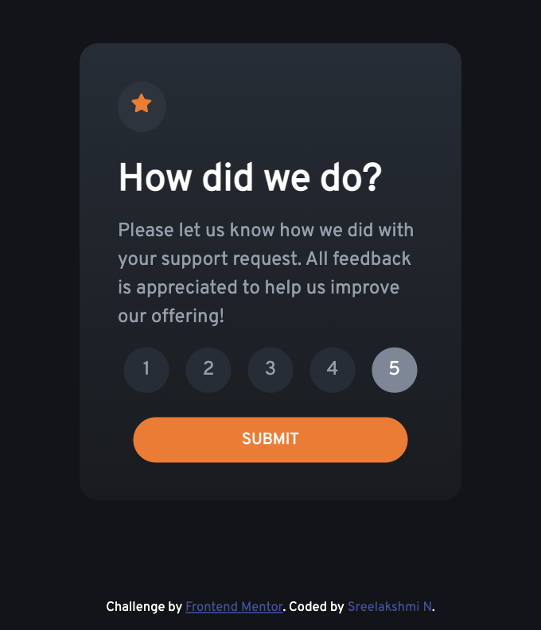
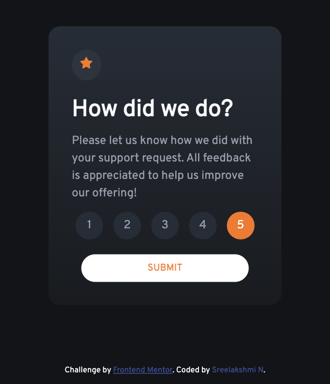

# Interactive rating component

This is a solution to the [Interactive rating component challenge on Frontend Mentor](https://www.frontendmentor.io/challenges/interactive-rating-component-koxpeBUmI). Frontend Mentor challenges help you improve your coding skills by building realistic projects.

## Table of contents

- [Overview](#overview)
  - [The challenge](#the-challenge)
  - [Screenshot](#screenshots-of-my-solution)
  - [Links](#links)
- [My process](#my-process)
  - [Built with](#built-with)
  - [Continued development](#continued-development)
- [Author](#author)
- [Acknowledgments](#acknowledgments)

## Overview

### The challenge

Users should be able to:

- View the optimal layout for the app depending on their device's screen size
- See hover states for all interactive elements on the page
- Select and submit a number rating
- See the "Thank you" card state after submitting a rating

### Screenshots of my Solution

  
  
  
  

### Links

- [Solution URL](https://github.com/sree-lakshmi-n/Interactive-Rating-Component)
- [Live Site URL](https://sree-lakshmi-n.github.io/Interactive-Rating-Component/)

## My process

### Built with

- Semantic HTML5 markup
- CSS custom properties
- Flexbox
- Media Queries

### Continued development

I have developed this project using HTML, CSS, and Vanilla JS. Hope to develop/ improve using frameworks.

## Author

- Frontend Mentor - [@sree-lakshmi-n](https://www.frontendmentor.io/profile/sree-lakshmi-n)

## Acknowledgments

- Front end mentor for the challenge ides
- MDN documentation, W3Schools, css-tricks, stack-overflow
- Jonas Schmedtmann Udemy Course
